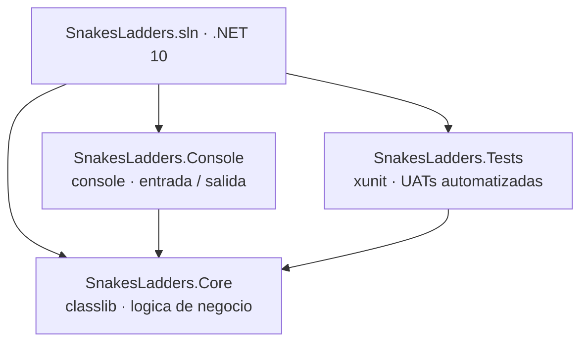

# Snakes and Ladders - Technical Test

Juego de Serpientes y Escaleras para consola desarrollado en C# / .NET 10.

## Requisitos

- [.NET 10 SDK](https://dotnet.microsoft.com/download)

## Como ejecutar el juego

```bash
dotnet run --project SnakesLadders.Console
```

## Como jugar

1. Al iniciar, escribe tu nombre y presiona **ENTER**
2. Cada turno: presiona **ENTER** para lanzar el dado
3. El dado arroja un numero del 1 al 6 y tu ficha avanza esa cantidad de casillas
4. Si tu posicion supera la casilla 100, el movimiento no se aplica
5. Ganas cuando llegues exactamente a la casilla **100**
6. Escribe `salir` en cualquier momento para terminar el juego

## Como ejecutar las pruebas

```bash
dotnet test
```

## Arquitectura



`SnakesLadders.Core` es el unico proyecto sin dependencias externas. `Console` y `Tests` referencian `Core` pero no se conocen entre si.

## Estructura del proyecto

```
SnakesLadders.Core/      -> Logica del juego (Board, Token, Player, Game, Die)
SnakesLadders.Console/   -> Interfaz de consola (Program.cs)
SnakesLadders.Tests/     -> Pruebas unitarias con xUnit
```

---

## Analisis del proyecto

### Objetivo

> Como programamos el movimiento para que hoy funcione de forma basica, pero que manana sea facil agregar modificaciones sin tener que rehacer todo el codigo?

La respuesta esta en disenar cada clase con una sola responsabilidad y que las dependencias apunten hacia abstracciones, no hacia implementaciones concretas. Esto permite extender el comportamiento del juego (nuevas reglas, nuevos tipos de dado, multiples jugadores) sin modificar el codigo que ya funciona.

---

### Principios SOLID aplicados

#### S - Principio de responsabilidad unica
Cada clase tiene un unico motivo para cambiar:

| Clase | Responsabilidad |
|---|---|
| `Token` | Guardar y actualizar la posicion de la ficha |
| `Board` | Validar reglas del tablero y mover la ficha |
| `Die` | Generar un numero aleatorio entre 1 y 6 |
| `Player` | Agrupar nombre y ficha de un jugador |
| `Game` | Coordinar el flujo de cada turno |

Si manana se agregan serpientes y escaleras, solo se modifica `Board`. El resto no cambia.

#### O - Principio abierto/cerrado
El sistema esta abierto para extension pero cerrado para modificacion. Si se necesita un dado con mas caras o un dado con pesos cargados, basta con crear una nueva clase que implemente `IDie`, sin tocar `Game`, `Board` ni los tests existentes.

```csharp
public class TwelveSidedDie : IDie
{
    private readonly Random _random = new();
    public int Roll() => _random.Next(1, 13);
}
```

#### L - Principio de sustitucion de Liskov
`FakeDie` sustituye a `Die` en los tests sin romper el comportamiento esperado. Cualquier implementacion de `IDie` puede usarse en `Game` de forma intercambiable.

#### I - Principio de segregacion de interfaces
`IDie` expone un unico metodo `Roll()`. No se fuerza a ninguna clase a implementar metodos que no necesita.

#### D - Principio de inversion de dependencias
`Game` depende de la abstraccion `IDie`, no de la clase concreta `Die`. Esto es lo que permite inyectar `FakeDie` en los tests para controlar el resultado del dado y probar el comportamiento del juego de manera predecible.

```csharp
// Game recibe IDie, no Die
public Game(Player player, IDie die) { ... }

// En produccion
var game = new Game(player, new Die());

// En tests
var game = new Game(player, new FakeDie(4));
```

---

### Por que este diseno facilita cambios futuros

Sin este diseno, agregar una nueva regla significaria editar multiples clases y romper tests existentes. Con este diseno:

- **Agregar serpientes y escaleras** -> solo se modifica `Board.Move()`
- **Multiples jugadores** -> `Game` recibe una lista de `Player`, sin cambiar `Token` ni `Board`
- **Dado diferente** -> nueva clase que implementa `IDie`, cero cambios en el resto
- **Interfaz grafica** -> se reutiliza todo `SnakesLadders.Core` sin modificarlo